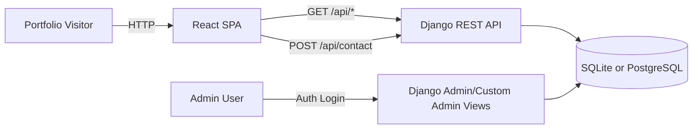
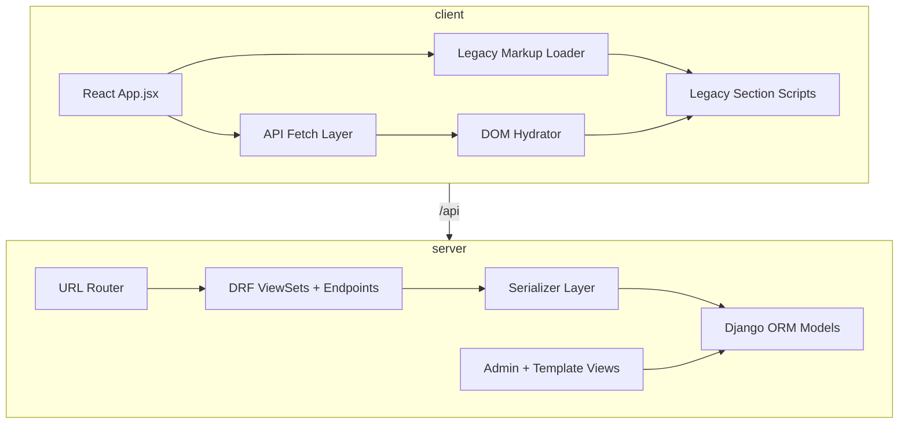
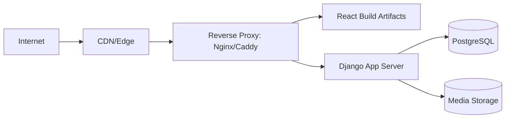
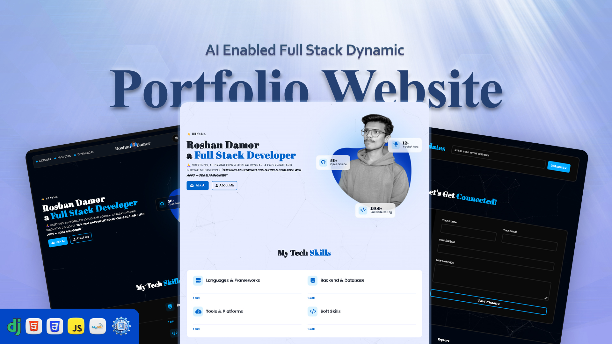
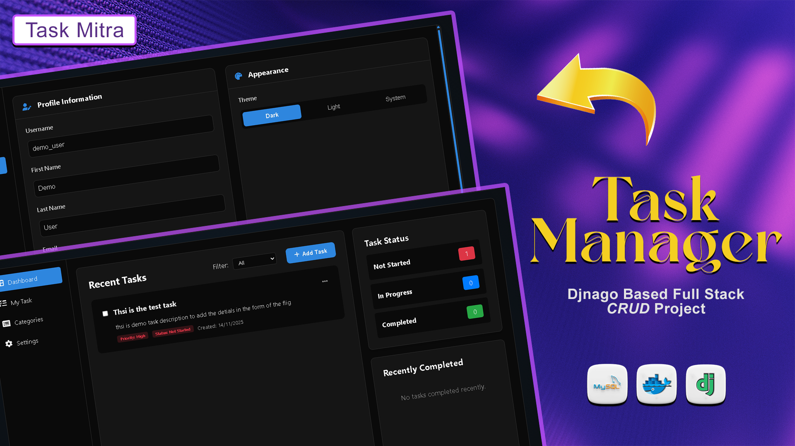
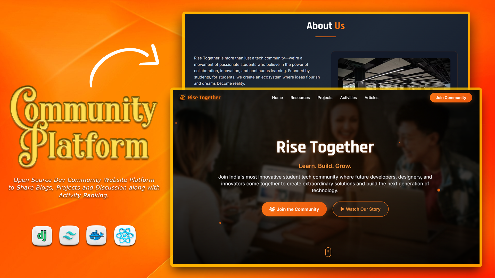

# Modern Portfolio React + Django (Monorepo)

A production-oriented portfolio platform with a React public site, a Django content management/admin system, and a read-only public API consumed by the frontend.

This repository is organized as a monorepo:

- `client/` contains the React + Vite frontend.
- `server/` contains the Django backend (admin + API + data layer).

The architecture supports:

- Public portfolio delivery from React.
- Secure content operations through authenticated Django admin routes.
- Dynamic section rendering on the frontend through API hydration.
- Contact form submission with backend persistence and anti-spam controls.

---

## 1. Product Vision

### 1.1 Purpose

The project is designed to solve two practical needs:

1. A fast, polished portfolio experience for visitors.
2. A maintainable backend workflow for updating content without frontend code edits.

### 1.2 Core Goals

- Keep the visual identity and legacy section interactions stable.
- Move content source of truth to backend-managed entities.
- Expose clean API endpoints for future app/mobile integrations.
- Make deployment predictable across local and production environments.

---

## 2. Major Features

### 2.1 Public Portfolio (Frontend)

- Single-page portfolio experience with section-based navigation.
- Legacy UI layout and animations preserved.
- Dynamic hydration for:
	- Profile
	- Projects
	- Skills
	- Experience timeline
- Contact form connected to backend API.
- Responsive behavior for desktop and mobile breakpoints.

### 2.2 Admin + Content Management (Backend)

- Auth-protected dashboard and management pages.
- CRUD workflows for:
	- Projects
	- Experience
	- Skills
	- Achievements
	- Categories
	- Profile details
- TinyMCE-backed rich text support for selected content forms.
- Contact message inbox via Django admin model registration.

### 2.3 Public API

- Read-only portfolio endpoints for public consumption.
- Pagination for list endpoints through DRF defaults.
- Specialized summary and health endpoints.
- Contact submission endpoint with validation, throttling, and duplicate detection.

### 2.4 Security and Reliability Controls

- Environment-driven security settings.
- CORS and CSRF trust list controls.
- JWT authentication support configured in DRF.
- HTTPS and HSTS readiness for production.
- Contact endpoint anti-spam protections:
	- Length checks
	- URL density checks
	- Keyword filtering
	- Per-IP/per-email short-window limits
	- Duplicate message lockout window

---

## 3. Technology Stack

### 3.1 Frontend

- React 18
- Vite 5
- Vanilla JS section scripts (legacy compatibility layer)
- CSS module split by section

### 3.2 Backend

- Python 3.11+
- Django 5.2
- Django REST Framework 3.16
- django-cors-headers
- Simple JWT
- Pillow (media/image handling)

### 3.3 Data and Storage

- SQLite for local development (default)
- PostgreSQL for production (env-switched)
- Media file storage under `server/media/`

---

## 4. System Design

### 4.1 Context Diagram



### 4.2 High-Level Runtime Architecture



### 4.3 Request Flow (Public Page)

1. React loads `portfolio-body.html`.
2. React fetches API payloads in parallel for profile/projects/skills/experience.
3. Hydration layer updates existing DOM blocks with backend data.
4. Legacy section scripts are loaded sequentially to preserve script dependency order.
5. User interactions (FAQ, project slider, modal, sound, contact form) execute via legacy JS behavior.

### 4.4 Request Flow (Contact Submission)

1. User submits contact form on frontend.
2. Client posts JSON payload to `POST /api/contact/`.
3. Backend performs anti-spam and payload validation.
4. On success, message is persisted in `ContactMessage`.
5. API returns success/error response; frontend shows inline notice.

---

## 5. Monorepo Structure

```text
Code Portfolio/
	client/
		public/
			portfolio-body.html
			static/
				css/
				js/
				images/
		src/
			api/
			App.jsx
			main.jsx
		package.json
		vite.config.js

	server/
		config/
			settings.py
			urls.py
		portfolio/
			models.py
			views.py
			api_views.py
			api_urls.py
			serializers.py
			admin.py
			migrations/
		templates/
		static/
		media/
		manage.py
		requirements.txt

	README.md
```

---

## 6. Data Model Overview

Primary backend entities in `portfolio.models`:

- `Category`
	- Shared category taxonomy for projects/skills/achievements/experience.
- `Project`
	- Core project metadata, links, status, ordering, and thumbnail.
- `ProjectScreenshot`
	- One-to-many screenshots attached to a project.
- `UserProfile`
	- Owner profile data (bio, social links, SEO metadata, availability).
- `Experience`
	- Work history entries with rich descriptions and timeline fields.
- `ExperienceImage`
	- One-to-many media for each experience entry.
- `Skill`
	- Skill proficiency, icon/certificate metadata, visibility flags.
- `Achievement`
	- Credentials/awards with optional files/links and category mapping.
- `ContactMessage`
	- Public contact submissions with metadata fields:
		- `ip_address`
		- `user_agent`
		- `source`
		- `is_read`

Contact model indexing is optimized for anti-spam queries:

- index on `created_at`
- compound index on `email + created_at`
- compound index on `ip_address + created_at`

---

## 7. API Reference

Base URL (dev): `http://127.0.0.1:8000/api/`

### 7.1 Read APIs

- `GET /api/health/`
	- Returns API health metadata.
- `GET /api/summary/`
	- Returns total and active counts for main content buckets.
- `GET /api/profile/`
	- Returns single profile object.
- `GET /api/projects/`
	- Supports filters: `category`, `status`, `featured`.
- `GET /api/projects/featured/`
	- Returns top featured projects.
- `GET /api/experience/`
	- Supports `employment_type` filter.
- `GET /api/skills/`
	- Supports `level` filter.
- `GET /api/skills/top/`
	- Returns top skills by proficiency.
- `GET /api/achievements/`
	- Supports `category` filter.
- `GET /api/categories/`
	- Supports `type` filter.

### 7.2 Write API

- `POST /api/contact/`
	- Body:

```json
{
	"full_name": "Your Name",
	"email": "you@example.com",
	"message": "Hello, I would like to connect...",
	"is_urgent": false
}
```

	- Successful response: `201 Created`
	- Validation errors: `400`
	- Duplicate content window block: `409`
	- Throttle limits hit: `429`

---

## 8. Frontend Design and Behavior Notes

### 8.1 Legacy-to-React Compatibility Strategy

Instead of rewriting every section script immediately, the frontend uses an adapter approach:

1. Load static HTML shell (`portfolio-body.html`) into React.
2. Fetch latest data from backend APIs.
3. Hydrate key blocks by writing to known DOM selectors.
4. Load legacy scripts in deterministic order.

This approach preserves existing animation logic and interaction behavior while still enabling dynamic data.

### 8.2 Vite Proxy Integration

Development proxy forwards:

- `/api` -> `http://127.0.0.1:8000`
- `/media` -> `http://127.0.0.1:8000`

This removes cross-origin friction during local development.

---

## 9. Backend Architecture Notes

### 9.1 URL Layers

- `config/urls.py`
	- `admin/` for Django admin.
	- `api/` for DRF endpoints.
	- root (`""`) for custom admin dashboard and management views.

### 9.2 Backend Interfaces

- Template-based admin views for operational content management.
- DRF viewsets for public read APIs.
- Function views for summary, health, and contact write flow.

### 9.3 Authentication and Permissions

- Admin/content routes are login-protected.
- Public API reads use safe-method-only permission.
- Contact endpoint intentionally allows anonymous access with protection heuristics.

---

## 10. Environment Configuration

### 10.1 Backend (`server/.env`)

Use `server/.env.example` for baseline and `server/.env.production.example` for hardened production values.

Important backend environment variables:

- `DJANGO_SECRET_KEY`
- `DJANGO_DEBUG`
- `DJANGO_ALLOWED_HOSTS`
- `DB_ENGINE`, `DB_NAME`, `DB_USER`, `DB_PASSWORD`, `DB_HOST`, `DB_PORT`
- `CORS_ALLOWED_ORIGINS`
- `CSRF_TRUSTED_ORIGINS`
- `TINYMCE_API_KEY`
- `SECURE_SSL_REDIRECT`
- `SECURE_HSTS_SECONDS`

### 10.2 Frontend (`client/.env`)

- `VITE_API_BASE_URL`
	- Default recommended value: `/api`

---

## 11. Local Development Setup

### 11.1 Prerequisites

- Node.js 18+
- npm 9+
- Python 3.11+
- pip

### 11.2 Backend Setup

```bash
cd server
python -m venv ../.venv
# Windows:
..\.venv\Scripts\activate
pip install -r requirements.txt
copy .env.example .env
python manage.py migrate
python manage.py createsuperuser
python manage.py runserver 0.0.0.0:8000
```

### 11.3 Frontend Setup

```bash
cd client
npm install
copy .env.example .env
npm run dev -- --host 0.0.0.0 --port 5173
```

Frontend URL: `http://127.0.0.1:5173`
Backend URL: `http://127.0.0.1:8000`

---

## 12. Production Deployment Blueprint

### 12.1 Intended Domains

- Public portfolio: `www.roshandamor.me`
- Admin/API backend: `admin.roshandamor.me`

### 12.2 Suggested Infrastructure Pattern



### 12.3 Production Checklist

1. Set strong secret keys and API keys.
2. Set `DJANGO_DEBUG=False`.
3. Configure PostgreSQL and run migrations.
4. Configure HTTPS certificates.
5. Enable strict host/CORS/CSRF values.
6. Run:

```bash
python manage.py check --deploy
```

7. Build frontend with `npm run build`.

---

## 13. Screenshots (Project SS)

> These are linked from repository assets. Replace/add images anytime by updating paths.

### 13.1 Public UI


### 13.2 About Section Visual Assets


### 13.3 Project Thumbnail Assets





---

## 14. Performance and Scalability Notes

### 14.1 Current Optimizations

- DRF pagination default enabled globally.
- Query filtering in viewsets to reduce payload size.
- Contact message indexes tuned for frequent anti-spam checks.
- Frontend API requests executed in parallel for hydration.

### 14.2 Scaling Path

- Add response caching for frequently read endpoints.
- Move media to object storage (S3-compatible) behind CDN.
- Introduce async jobs (email notifications, media processing).
- Add dedicated rate limiting at reverse proxy layer.

---

## 15. Security Deep Notes

### 15.1 App-Level

- Safe-method restriction for read-only public endpoints.
- Contact endpoint blocks noisy/spam-like patterns.
- Admin interfaces protected by authentication middleware.

### 15.2 Config-Level

- Secure cookie options derived from debug mode.
- SSL and HSTS flags configurable via environment.
- Host and origin allowlists configurable by deployment environment.

### 15.3 Operational Guidance

- Never commit real `.env` secrets.
- Rotate API keys and secret keys periodically.
- Audit admin user accounts and session hygiene regularly.

---

## 16. Known Trade-Offs

1. Legacy script compatibility layer prioritizes stability over full React componentization.
2. DOM hydration is selector-based, so structural HTML changes must preserve selector contracts.
3. Contact anti-spam is heuristic-based and can be extended with captcha or external anti-bot systems.

---

## 17. Future Roadmap

1. Full React component migration for all portfolio sections.
2. API versioning strategy (`/api/v1/`).
3. Automated tests:
	 - DRF endpoint tests
	 - contact anti-spam edge-case tests
	 - frontend integration smoke tests
4. CI/CD pipeline for lint/build/test/deploy gates.
5. Observability integration (error tracking + performance dashboards).

---

## 18. Useful Commands

### Backend

```bash
cd server
python manage.py makemigrations
python manage.py migrate
python manage.py check
python manage.py check --deploy
python manage.py createsuperuser
python manage.py runserver 0.0.0.0:8000
```

### Frontend

```bash
cd client
npm install
npm run dev -- --host 0.0.0.0 --port 5173
npm run build
npm run preview
```

---

## 19. Repository Notes

- Branch: `main`
- Remote: `https://github.com/logicbyroshan/modern-portfolio-react.git`
- Project type: monorepo with split frontend/backend architecture

---

## 20. License

This project is private/personal portfolio work unless you explicitly attach an open-source license.
